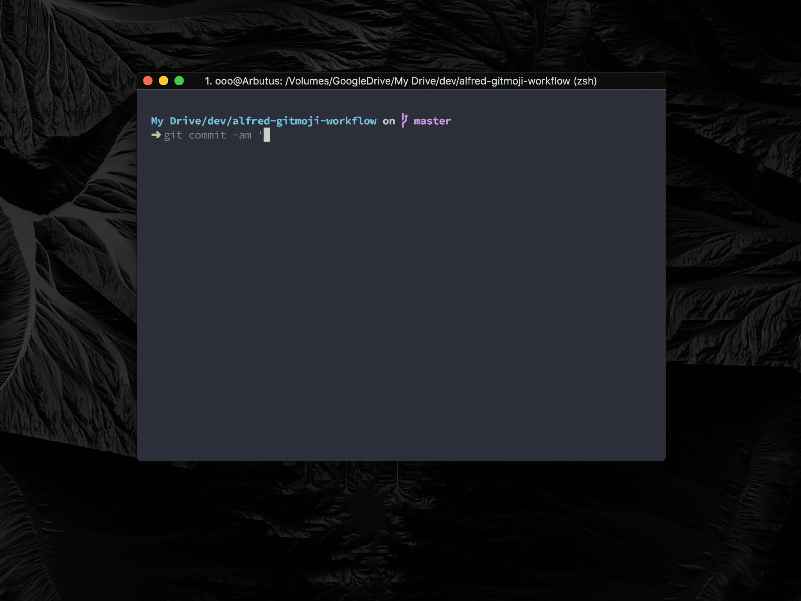

  
  

	
	

## About

This simple [Alfred](https://www.alfredapp.com/) workflow lets you quick search and input [gitmoji](https://github.com/carloscuesta/gitmoji).

## Install

### Manual

[Download](https://github.com/ai0/alfred-gitmoji-workflow/releases) and open file using Alfred.

### Packal

[Link](http://www.packal.org/workflow/gitmoji)

## Usage

`gitmoji` List all gitmojis

`gitmoji [keyword]` Search gitmoji use keyword

After you hit `Enter↩` the selected gitmoji will be inputted to front most app. And you can also use `⌘ + C` to just copy selected gitmoji. 

## Configuration

The workflow is configured via the configuration sheet ([𝒙]) in Alfred Preferences and via a couple of text files in its data directory.

### Configuration sheet

Basic configuration is performed in the configuration sheet:

| Option | Value | Description |
| --- | --- | --- |
| `GITMOJI_COPY_TYPE` | [code\|emoji] | The output type of gitmoji, `code` will return pure text like `:fire:`, and `emoji` will return unicode emoji.  |

## Screenshot

  

## License

[MIT License](https://i.mit-license.org/)

